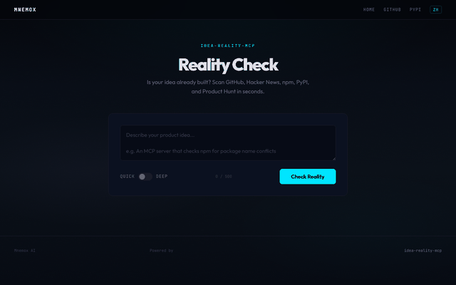

<!-- mcp-name: io.github.mnemox-ai/idea-reality-mcp -->
English | [繁體中文](README.zh-TW.md)

# idea-reality-mcp

**We search. They guess.**

The only idea validator that searches real data. 5 sources. Quantified signal. Zero hallucination.

[](https://opensource.org/licenses/MIT)
[](https://www.python.org/downloads/)
[](https://modelcontextprotocol.io/)
[](https://pypi.org/project/idea-reality-mcp/)
[](https://idea-reality-mcp--mnemox-ai.run.tools)
[](https://github.com/mnemox-ai/idea-reality-mcp)

<p align="center">
  
</p>

## The problem

Every developer has wasted days building something that already exists with 5,000 stars on GitHub.

You ask ChatGPT: *"Is there already a tool that does X?"*

ChatGPT says: *"That's a great idea! There are some similar tools, but you can definitely build something better!"*

**That's not validation. That's cheerleading.**

## What we do instead

```
You: "AI code review tool"

idea-reality-mcp:
├── reality_signal: 90/100
├── GitHub repos: 847
├── Top competitor: reviewdog (9,094 ⭐)
├── npm packages: 56
├── HN discussions: 254
└── Verdict: HIGH — consider pivoting to a niche
```

One gives you encouragement. The other gives you facts.

**Which one do you trust your next 3 months on?**

## Try it now (30 seconds)

```bash
uvx idea-reality-mcp
```

Or [try it in your browser](https://mnemox.ai/check) — no install required.

## Why not just ask ChatGPT?

| | idea-reality-mcp | ChatGPT / ValidatorAI / IdeaProof |
|---|---|---|
| **Data source** | GitHub + HN + npm + PyPI + Product Hunt (real-time) | LLM generation (no real source searched) |
| **Output** | Score 0-100 + real projects with star counts | Text opinion ("Sounds promising!") |
| **Verifiable** | Every number has a source | Not verifiable |
| **Integration** | MCP / CLI / API / Web | Web-only |
| **Price** | Free, open-source, forever | Free trial → paywall |
| **Audience** | Developers (before writing code) | Non-technical founders (before writing pitch decks) |

**TL;DR — We search 5 real databases. They generate opinions.**

## New: AI-powered search intelligence

**Claude Haiku 4.5** now generates optimal search queries from your idea description — in any language — with automatic fallback to our battle-tested dictionary pipeline.

| | Before | Now |
|---|---|---|
| English ideas | ✅ Good | ✅ Good |
| Chinese / non-English ideas | ⚠️ Dictionary lookup (150+ terms) | ✅ Native understanding |
| Ambiguous descriptions | ⚠️ Keyword matching | ✅ Semantic extraction |
| Reliability | 100% (no external API) | 100% (graceful fallback to dictionary) |

The LLM understands your idea. The dictionary is your safety net. **You always get results.**

## Make your AI agent check automatically

Add this to your `.claude/instructions.md` or `CLAUDE.md`:

```
Before building any new tool, feature, or project,
always run idea_check first to verify the idea hasn't been built already.
```

**This is the highest-ROI setup.** Your AI agent will validate ideas before writing a single line of code. Install once, protect every project.

> **More templates:** [Claude Code](templates/CLAUDE.md) · [Cursor](templates/cursorrules.md) · [Windsurf](templates/windsurf-rules.md) · [Copilot](templates/copilot-instructions.md) — copy-paste snippets for every AI coding tool.

## Install (5 minutes)

### Claude Desktop

Paste into `~/Library/Application Support/Claude/claude_desktop_config.json` (macOS) or `%APPDATA%\Claude\claude_desktop_config.json` (Windows):

```json
{
  "mcpServers": {
    "idea-reality": {
      "command": "uvx",
      "args": ["idea-reality-mcp"]
    }
  }
}
```

### Cursor

Paste into `.cursor/mcp.json` in your project root:

```json
{
  "mcpServers": {
    "idea-reality": {
      "command": "uvx",
      "args": ["idea-reality-mcp"]
    }
  }
}
```

### Claude Code (CLI)

```bash
claude mcp add idea-reality -- uvx idea-reality-mcp
```

### Smithery (Remote)

```bash
npx -y @smithery/cli install idea-reality-mcp --client claude
```

### Optional: Environment variables

```bash
export GITHUB_TOKEN=ghp_...        # Higher GitHub API rate limits
export PRODUCTHUNT_TOKEN=your_...  # Enable Product Hunt (deep mode)
```

## Usage

### "I have a side project idea — should I build it?"

Tell your AI agent:

```
Before I start building, check if this already exists:
a CLI tool that converts Figma designs to React components
```

The agent calls `idea_check` and returns: reality_signal, top competitors, and pivot suggestions.

### "Find competitors and alternatives"

```
idea_check("open source feature flag service", depth="deep")
```

Deep mode scans all 5 sources in parallel — GitHub repos, HN discussions, npm packages, PyPI packages, and Product Hunt — and returns ranked results.

### "Build-or-buy sanity check before a sprint"

```
We're about to spend 2 weeks building an internal error tracking tool.
Run a reality check first.
```

If the signal comes back at 85+ with mature open-source alternatives, you just saved your team 2 weeks.

## Tool schema

### `idea_check`

| Parameter   | Type                      | Required | Description                          |
|-------------|---------------------------|----------|--------------------------------------|
| `idea_text` | string                    | yes      | Natural-language description of idea |
| `depth`     | `"quick"` \| `"deep"`     | no       | `"quick"` = GitHub + HN (default). `"deep"` = all 5 sources in parallel |

**Output:** `reality_signal` (0-100), `duplicate_likelihood`, `evidence[]`, `top_similars[]`, `pivot_hints[]`, `meta{}`

<details>
<summary>Full output example</summary>

```json
{
  "reality_signal": 72,
  "duplicate_likelihood": "high",
  "evidence": [
    {"source": "github", "type": "repo_count", "query": "...", "count": 342},
    {"source": "github", "type": "max_stars", "query": "...", "count": 15000},
    {"source": "hackernews", "type": "mention_count", "query": "...", "count": 18},
    {"source": "npm", "type": "package_count", "query": "...", "count": 56},
    {"source": "pypi", "type": "package_count", "query": "...", "count": 23},
    {"source": "producthunt", "type": "product_count", "query": "...", "count": 8}
  ],
  "top_similars": [
    {"name": "user/repo", "url": "https://github.com/...", "stars": 15000, "description": "..."}
  ],
  "pivot_hints": [
    "High competition. Consider a niche differentiator...",
    "The leading project may have gaps in...",
    "Consider building an integration or plugin..."
  ],
  "meta": {
    "sources_used": ["github", "hackernews", "npm", "pypi", "producthunt"],
    "keyword_source": "llm",
    "depth": "deep",
    "version": "0.3.2"
  }
}
```

</details>

### Scoring weights

| Mode | GitHub repos | GitHub stars | HN | npm | PyPI | Product Hunt |
|------|-------------|-------------|-----|-----|------|-------------|
| Quick | 60% | 20% | 20% | — | — | — |
| Deep | 25% | 10% | 15% | 20% | 15% | 15% |

If Product Hunt is unavailable (no token), its weight is redistributed automatically.

## CI: Auto-check on Pull Requests

Add `.github/workflows/idea-check.yml` to run reality checks when PRs propose new features:

```yaml
name: Idea Reality Check
on:
  pull_request:
    paths: ['docs/proposals/**', 'RFC/**']

jobs:
  check:
    runs-on: ubuntu-latest
    steps:
      - uses: actions/checkout@v4
      - uses: actions/setup-python@v5
        with:
          python-version: '3.11'
      - run: pip install idea-reality-mcp httpx
      - name: Run idea check
        env:
          GITHUB_TOKEN: ${{ secrets.GITHUB_TOKEN }}
        run: |
          python -c "
          import asyncio, json
          from idea_reality_mcp.sources.github import search_github_repos
          from idea_reality_mcp.sources.hn import search_hn
          from idea_reality_mcp.scoring.engine import compute_signal, extract_keywords

          async def main():
              idea = open('docs/proposals/latest.md').read()[:500]
              kw = extract_keywords(idea)
              gh = await search_github_repos(kw)
              hn = await search_hn(kw)
              report = compute_signal(gh, hn)
              print(json.dumps(report, indent=2))

          asyncio.run(main())
          "
      - name: Comment on PR
        if: always()
        uses: actions/github-script@v7
        with:
          script: |
            github.rest.issues.createComment({
              owner: context.repo.owner,
              repo: context.repo.repo,
              issue_number: context.issue.number,
              body: '## Idea Reality Check\nSee workflow run for full report.'
            })
```

## Roadmap

- [x] **v0.1** — GitHub + HN search, basic scoring
- [x] **v0.2** — Deep mode (npm, PyPI, Product Hunt), improved keyword extraction
- [x] **v0.3** — 3-stage keyword pipeline, 150+ Chinese term mappings, synonym expansion, LLM-powered search (Render API)
- [ ] **v0.4** — Trend detection and timing analysis
- [ ] **v1.0** — Idea Memory Dataset (opt-in anonymous logging)

## Found a blind spot?

If the tool missed obvious competitors or returned irrelevant results:

1. [Open an issue](https://github.com/mnemox-ai/idea-reality-mcp/issues/new?template=inaccurate-result.yml) with your idea text and the output
2. We'll improve the keyword extraction for your domain

## License

MIT — see [LICENSE](LICENSE)

## Contact

Built by [Mnemox AI](https://mnemox.ai) · [dev@mnemox.ai](mailto:dev@mnemox.ai)
