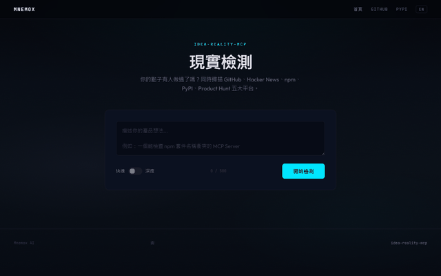

[English](README.md) | 繁體中文

# idea-reality-mcp

AI 開發前的現實查核工具。別再重複造輪子了。

[](https://opensource.org/licenses/MIT)
[](https://www.python.org/downloads/)
[](https://modelcontextprotocol.io/)
[](https://pypi.org/project/idea-reality-mcp/)
[](https://idea-reality-mcp--mnemox-ai.run.tools)

<p align="center">
  
</p>

## 30 秒：立刻試用

```bash
uvx idea-reality-mcp
```

或 [在瀏覽器直接試用](https://mnemox.ai/check) — 不需安裝。

## 這是什麼（以及不是什麼）

`idea-reality-mcp` 是一個 MCP 工具，在你寫任何一行程式碼之前，自動掃描**現有供給** — GitHub repos、Hacker News 討論、npm/PyPI 套件、Product Hunt 產品。

回傳 **reality signal**（0-100）、最相似專案、以及轉向建議。

**這不是：**
- 商業計畫生成器
- 通用的「市場調研」prompt 包裝
- 告訴你點子「好不好」的 AI

**這是：**
- 開工前的供給側掃描器：查有沒有人做過
- AI coding agent 的工具層（MCP 協定）
- 幾秒出結果，不是幾小時

## 5 分鐘：三種使用場景

### 場景 1：「我有個 side project 點子，該不該做？」

對你的 AI agent 說：
```
在開始之前，幫我查一下有沒有人做過：
一個自動把 Figma 設計稿轉成 React 元件的 CLI 工具
```

Agent 會呼叫 `idea_check`，回傳：reality_signal、競品列表、3 個轉向建議。

### 場景 2：「我要找競品和替代方案」

```
idea_check("open source feature flag service", depth="deep")
```

Deep mode 平行掃描全部 5 個來源（GitHub + HN + npm + PyPI + Product Hunt），回傳按相關度排序的相似專案，含星數、下載量、HN 討論連結。

### 場景 3：「Sprint 前的 Build-or-Buy 檢查」

```
我們準備花 2 週做內部的 error tracking 工具。
先跑一次現實檢查。
```

如果 signal 回來 85+，而且有成熟的開源替代品——你剛省了團隊 2 週。

## 1 小時：整合到你的工作流

### Claude Desktop

貼入 `~/Library/Application Support/Claude/claude_desktop_config.json`（macOS）或 `%APPDATA%\Claude\claude_desktop_config.json`（Windows）：

```json
{
  "mcpServers": {
    "idea-reality": {
      "command": "uvx",
      "args": ["idea-reality-mcp"]
    }
  }
}
```

重啟 Claude Desktop。然後問：*「幫我查有沒有人做過 markdown 轉簡報的工具。」*

### Cursor

貼入專案根目錄的 `.cursor/mcp.json`：

```json
{
  "mcpServers": {
    "idea-reality": {
      "command": "uvx",
      "args": ["idea-reality-mcp"]
    }
  }
}
```

打開 Command Palette → "MCP: List Tools" → 應該看到 `idea_check`。

### Claude Code（CLI）

在專案的 `CLAUDE.md` 加入：

```
當使用者討論新專案點子或詢問市場競爭時，使用 idea-reality-mcp 的 idea_check 工具。
```

之後正常聊天就好，agent 會在相關時機自動呼叫工具。

### CI：PR 開啟時自動檢查

在 `.github/workflows/idea-check.yml` 加入，當 PR 觸及提案文件時自動跑現實檢查：

```yaml
name: Idea Reality Check
on:
  pull_request:
    paths: ['docs/proposals/**', 'RFC/**']

jobs:
  check:
    runs-on: ubuntu-latest
    steps:
      - uses: actions/checkout@v4
      - uses: actions/setup-python@v5
        with:
          python-version: '3.11'
      - run: pip install idea-reality-mcp httpx
      - name: Run idea check
        env:
          GITHUB_TOKEN: ${{ secrets.GITHUB_TOKEN }}
        run: |
          python -c "
          import asyncio, json
          from idea_reality_mcp.sources.github import search_github_repos
          from idea_reality_mcp.sources.hn import search_hn
          from idea_reality_mcp.scoring.engine import compute_signal, extract_keywords

          async def main():
              idea = open('docs/proposals/latest.md').read()[:500]
              kw = extract_keywords(idea)
              gh = await search_github_repos(kw)
              hn = await search_hn(kw)
              report = compute_signal(gh, hn)
              print(json.dumps(report, indent=2))

          asyncio.run(main())
          "
```

### Smithery（遠端）

```bash
npx -y @smithery/cli install idea-reality-mcp --client claude
```

### 可選：環境變數

```bash
export GITHUB_TOKEN=ghp_...        # 提升 GitHub API 速率限制
export PRODUCTHUNT_TOKEN=your_...  # 啟用 Product Hunt（deep mode）
```

## 工具規格

### `idea_check`

| 參數 | 型別 | 必填 | 說明 |
|------|------|------|------|
| `idea_text` | string | 是 | 自然語言描述你的點子 |
| `depth` | `"quick"` \| `"deep"` | 否 | `"quick"` = GitHub + HN（預設）。`"deep"` = 全部 5 個來源平行查詢 |

**輸出：** `reality_signal`（0-100）、`duplicate_likelihood`、`evidence[]`、`top_similars[]`、`pivot_hints[]`、`meta{}`

<details>
<summary>完整輸出範例</summary>

```json
{
  "reality_signal": 72,
  "duplicate_likelihood": "high",
  "evidence": [
    {"source": "github", "type": "repo_count", "query": "...", "count": 342},
    {"source": "github", "type": "max_stars", "query": "...", "count": 15000},
    {"source": "hackernews", "type": "mention_count", "query": "...", "count": 18},
    {"source": "npm", "type": "package_count", "query": "...", "count": 56},
    {"source": "pypi", "type": "package_count", "query": "...", "count": 23},
    {"source": "producthunt", "type": "product_count", "query": "...", "count": 8}
  ],
  "top_similars": [
    {"name": "user/repo", "url": "https://github.com/...", "stars": 15000, "description": "..."}
  ],
  "pivot_hints": [
    "競爭激烈。考慮找一個利基差異化方向...",
    "領先專案（user/repo, 15000 stars）可能在某些面向有缺口...",
    "考慮做整合或外掛，而非從頭造輪子..."
  ],
  "meta": {
    "sources_used": ["github", "hackernews", "npm", "pypi", "producthunt"],
    "depth": "deep",
    "version": "0.3.1"
  }
}
```

</details>

### 評分權重

| 模式 | GitHub repos | GitHub stars | HN | npm | PyPI | Product Hunt |
|------|-------------|-------------|-----|-----|------|-------------|
| Quick | 60% | 20% | 20% | — | — | — |
| Deep | 25% | 10% | 15% | 20% | 15% | 15% |

Product Hunt 不可用時（未設 token），權重自動重新分配。

## Roadmap

- [x] **v0.1** — GitHub + HN 搜尋，基本評分
- [x] **v0.2** — Deep mode（npm、PyPI、Product Hunt），改進關鍵字萃取
- [x] **v0.3** — 三段式關鍵字 Pipeline，150+ 中文詞彙對照，同義詞展開
- [x] **v0.3.1** — 非科技領域精準度修復，相關性加權排序
- [ ] **v0.4** — LLM 驅動的關鍵字萃取和語意相似度
- [ ] **v0.5** — 趨勢偵測和時機分析
- [ ] **v1.0** — Idea Memory Dataset（匿名使用紀錄）

## 結果不準？

如果工具漏掉了明顯的競品，或回傳不相關的結果：

1. [開一個 Issue](https://github.com/mnemox-ai/idea-reality-mcp/issues/new?template=inaccurate-result.yml)，附上你的 idea text 和輸出
2. 我們會改進該領域的關鍵字萃取

零門檻的回饋，讓工具對所有人更好。

## 授權

MIT — 見 [LICENSE](LICENSE)

## 聯絡

由 [Mnemox AI](https://mnemox.ai) 打造 · [dev@mnemox.ai](mailto:dev@mnemox.ai)
